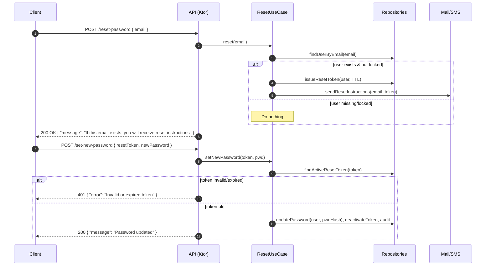
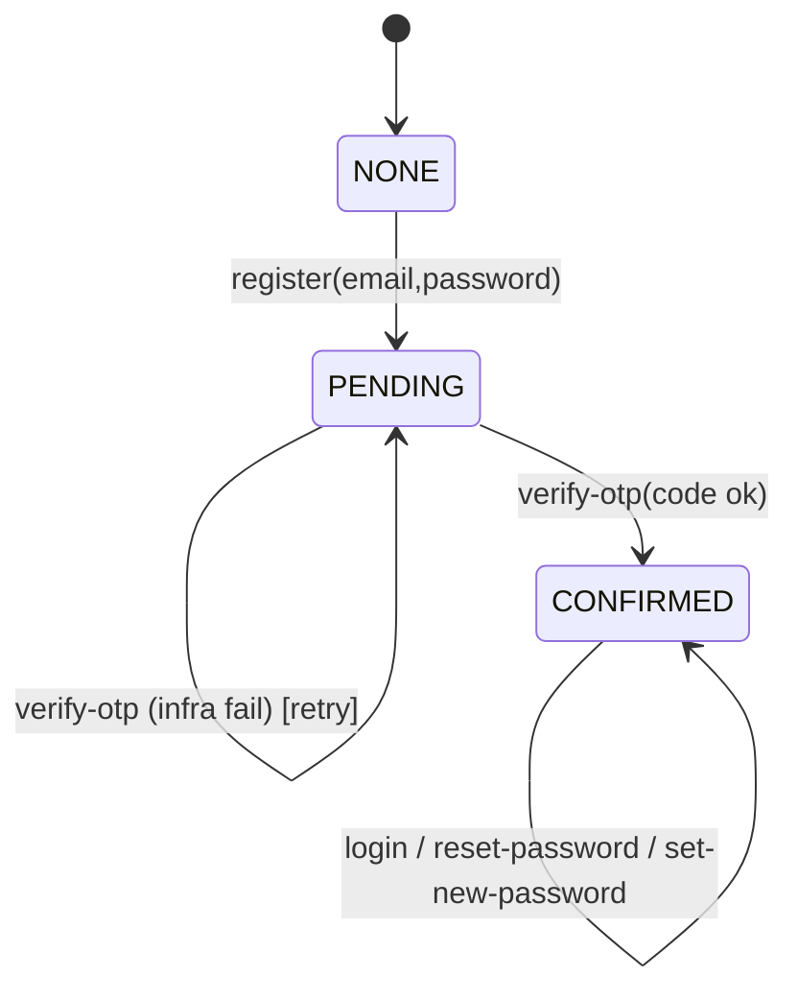

# Auth Flows — Business Logic (Kotlin/Ktor, Clean Architecture)

**Stack**: Kotlin, Ktor, Exposed, JVM 21, PostgreSQL.  
**Architecture**: Clean Architecture, functional style.

---

## 1) Entities and States

### User
- `email` (normalized, unique)
- `passwordHash`
- `status` ∈ { `NONE`, `PENDING`, `CONFIRMED` }
- `confirmedAt` (nullable)
- (opt.) `lockedUntil`

### OTP / Reset Token
- `codeHash` / `tokenHash`
- `expiresAt`
- `sentAt`
- `isActive`
- `attemptsLeft`
- (opt.) `resendCountWindow`

### Anti-abuse counters
- `registerRequests`, `loginFailures`, `resetRequests`, `verifyAttempts` per email/IP

---

## 2) Rules
- **Universal responses** for `/register` and `/reset-password` (never leak whether email exists).  
- **OTP TTL**: 10–15 min.  
- **Max verify attempts per OTP**: 5.  
- **Repeat /register**: do not issue new OTP while active one is still valid.  
- **Rate limiting**: e.g. 5/min and 50/day per email/IP.  
- **Transactional**: user and token changes in one transaction.  
- **Audit/metrics** for all auth events.

---

## 3) Flow: Register → Verify OTP → Login

```mermaid
flowchart TD
    A[POST /register] -->|email, password| B{User by email}
    B -->|NONE| C[Create PENDING user]
    C --> D[Issue OTP (TTL 10–15m), send]
    B -->|PENDING| E{Active OTP?}
    E -->|Yes & Not expired| F[Do not resend]
    E -->|No / Expired| D
    B -->|CONFIRMED| F
    F --> G[[Respond 200 OK (universal)]]

    H[POST /verify-otp] --> I{Find user & Active OTP}
    I -->|Not found / inactive| J[400 Invalid or expired OTP]
    I -->|Found| K{code matches?}
    K -->|No| L[dec attemptsLeft; 429 if too many]
    K -->|Yes| M[Confirm user; deactivate OTP; audit]
    M --> N[[200 OK "Verified"]]

    O[POST /login] --> P{User exists?}
    P -->|No| Q[401 Invalid credentials]
    P -->|Yes| R{Confirmed?}
    R -->|No| S[403 Email not verified]
    R -->|Yes| T{Password OK?}
    T -->|No| U[401 Invalid credentials + inc failures]
    T -->|Yes| V[Issue tokens / set session; audit]
    V --> W[[200 OK tokens]]
```

---

## 4) Flow: Reset Password → Set New Password



---

## 5) Endpoint Logic

### POST /register
- Validate JSON & fields.  
- Normalize email, basic password checks.  
- Load user:
  - `NONE` → create PENDING, issue OTP, send.  
  - `PENDING` → if active OTP valid → no resend; if expired → issue new.  
  - `CONFIRMED` → do nothing.  
- Rate-limit checks (log internally, still return 200).  
- Response: `200 OK` universal message.

### POST /verify-otp
- Validate `email`, `code`.  
- Find active OTP → if missing → `400 Invalid or expired OTP`.  
- Constant-time compare codes.  
- If invalid → dec attemptsLeft; if 0 → deactivate, return 429.  
- If valid → confirm user, deactivate OTP, audit → `200 Verified`.

### POST /login
- Validate `email`, `password`.  
- If user missing → `401 Invalid credentials`.  
- If PENDING → `403 Email not verified`.  
- If wrong password → `401` and increment failure counter.  
- If success → issue tokens/session, audit → `200`.  
- Apply per-email/IP rate-limits.

### POST /reset-password
- Validate `email`.  
- If user exists & not locked → issue resetToken, send instructions.  
- If not → do nothing.  
- Always return `200 OK` universal message.  

### POST /set-new-password
- Validate `resetToken`, `newPassword`.  
- If invalid/expired → `401`.  
- Enforce password policy.  
- Update password, deactivate token, audit.  
- (Opt.) auto-login or revoke old tokens.  
- Return `200 OK Password updated`.

---

## 6) Clean Architecture Components

- **UseCases**: `RegisterUseCase`, `VerifyOtpUseCase`, `LoginUseCase`, `RequestPasswordResetUseCase`, `SetNewPasswordUseCase`.  
- **Ports**: `UserRepo`, `OtpRepo`, `ResetTokenRepo`, `PasswordHasher`, `OtpGenerator`, `TokenIssuer`, `Mailer`, `Clock`, `RateLimiter`.  
- **Adapters**: Exposed repos (Postgres), Ktor routes, SMTP/SMS clients.  
- **Config**: `OtpConfig(ttl, maxAttempts)`, `RateLimitConfig(...)`, `PasswordPolicy(...)`.

---

## 7) Edge Cases

- Repeat `/register` while OTP still valid → no resend, user confirms with same OTP.  
- Lost emails → will be handled by future `/otp/resend`.  
- All comparisons must be constant-time.  
- Logs capture real failure reason; API responses remain safe.  

---

## 8) Default Policies (recommended)

- OTP TTL: 15m; Verify attempts: 5; Resend cooldown: 60s, max 5/hour.  
- Login failures → exponential backoff or `lockedUntil`.  
- Reset-token TTL: 60m, one-time use.  
- Required DB indexes: `users(email)`, `otp_tokens(user_id, is_active)`, `otp_tokens(expires_at)`, `reset_tokens(user_id, is_active)`, `reset_tokens(expires_at)`.

---

## 9) Example Interfaces

```kotlin
interface UserRepo {
    fun findByEmail(email: String): User?
    fun createPending(email: String, passwordHash: String, now: Instant): User
    fun confirm(userId: UserId, now: Instant)
    fun updatePassword(userId: UserId, passwordHash: String, now: Instant)
}

interface OtpRepo {
    fun findActive(userId: UserId, now: Instant): Otp?
    fun issue(userId: UserId, expiresAt: Instant): Otp
    fun deactivate(otpId: OtpId)
    fun decAttempts(otpId: OtpId): Int
}

interface ResetTokenRepo {
    fun findActiveByToken(tokenPlain: String, now: Instant): ResetToken?
    fun issue(userId: UserId, expiresAt: Instant): ResetToken
    fun deactivate(tokenId: ResetTokenId)
}
```

---

## 10) User State Diagram


